# Guess the Music 🎵

A local party game: the TV shows the stage, everyone's phone is a buzzer, songs play for real from YouTube.

It runs from a laptop on your WiFi — nothing to install on the Android TV itself besides its normal browser.

> 🎉 **A fun hobby project.** This is a for-fun side project built for game nights with friends and family — not a polished commercial product. It works well for us, and you're welcome to use it, fork it, or poke around, but expect a few rough edges.

## A tour of the game

Everything below is the real app, captured from a demo game.

### 1. The TV waits for players
The TV (or any big screen) shows a QR code. Players scan it with their phones to grab a buzzer.

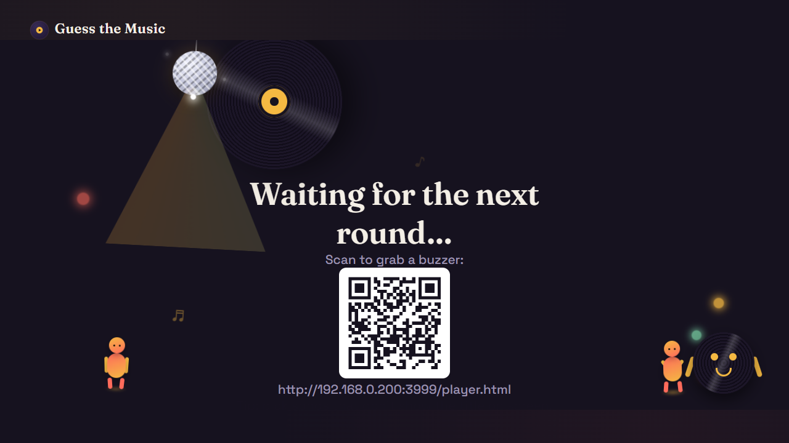

### 2. Players join from their phones
Type a name and you're in. Everyone shows up on the TV scoreboard right away.

<p>
  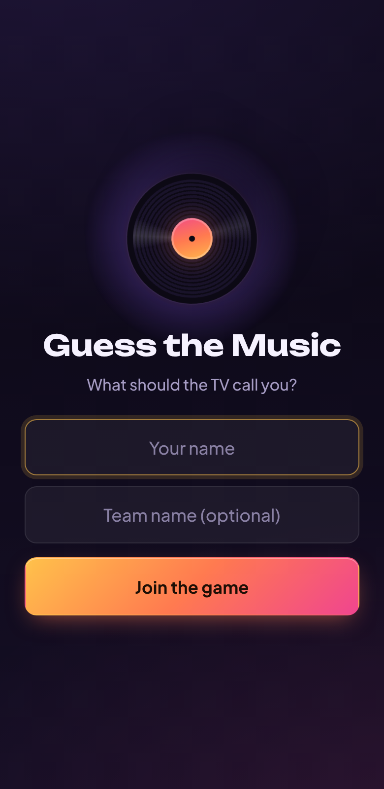
  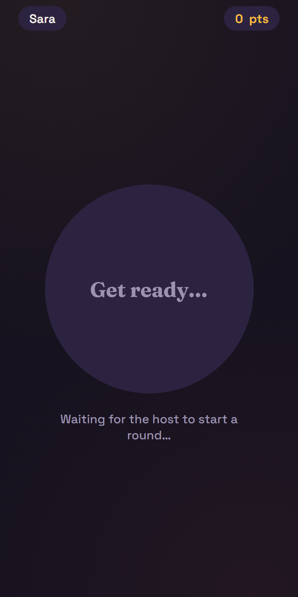
</p>

### 3. The host runs the show
The host page is the control panel: the playlist (search, category filters, drag-to-reorder), the scoreboard, and a list of toggleable game options. Songs can be added one at a time or imported from a YouTube playlist, and with an Anthropic API key the game can [suggest a category for each song automatically](#auto-categories-optional).

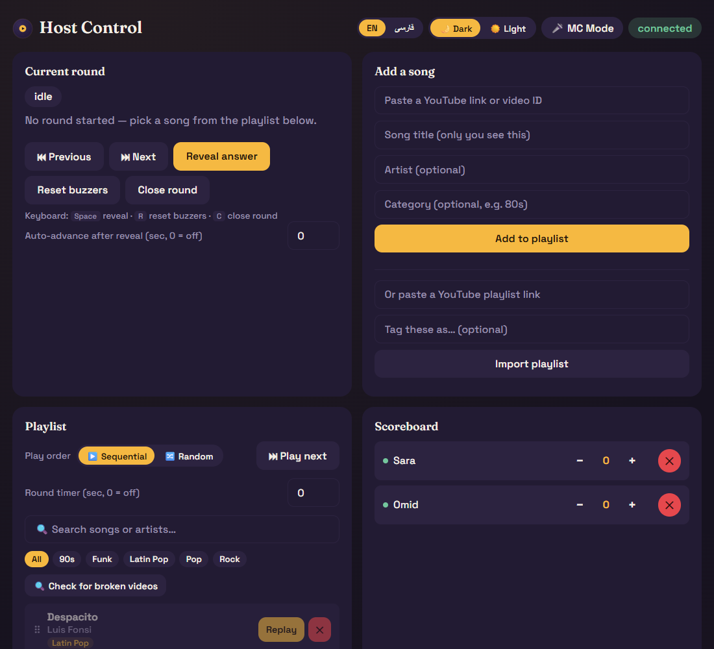

### 4. A song plays — first to buzz wins the floor
The song plays through the TV while a spinning record hides the video. The first phone to tap **BUZZ** locks everyone else out and their name takes over the screen.

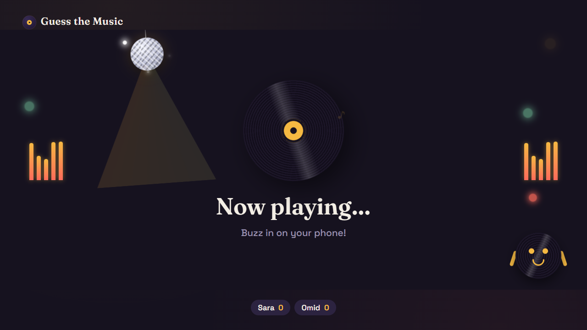
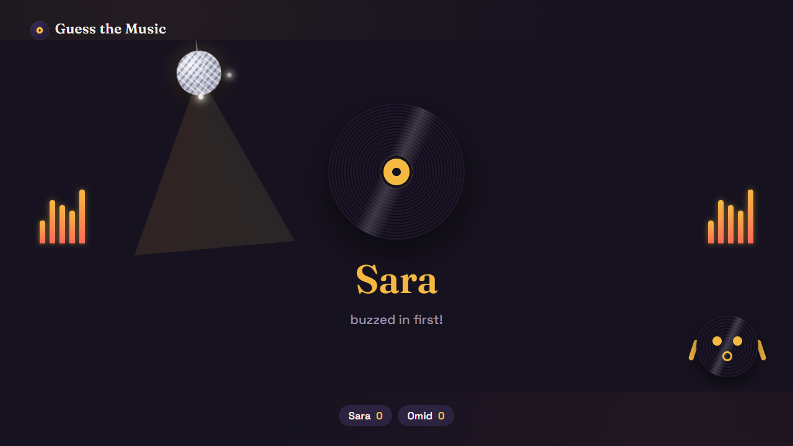

On the phones, the buzzer lights up the moment buzzing opens, and turns green for whoever got there first. The host sees who buzzed and awards (or withholds) the point with one tap.

<p>
  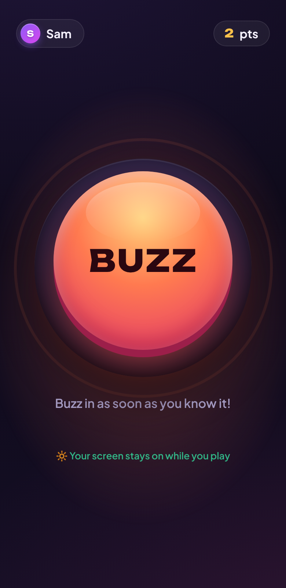
  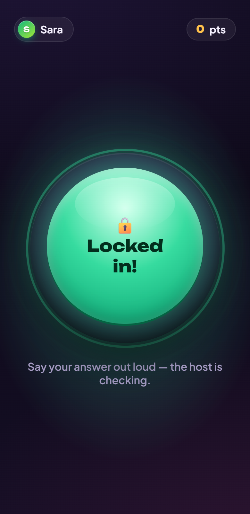
</p>

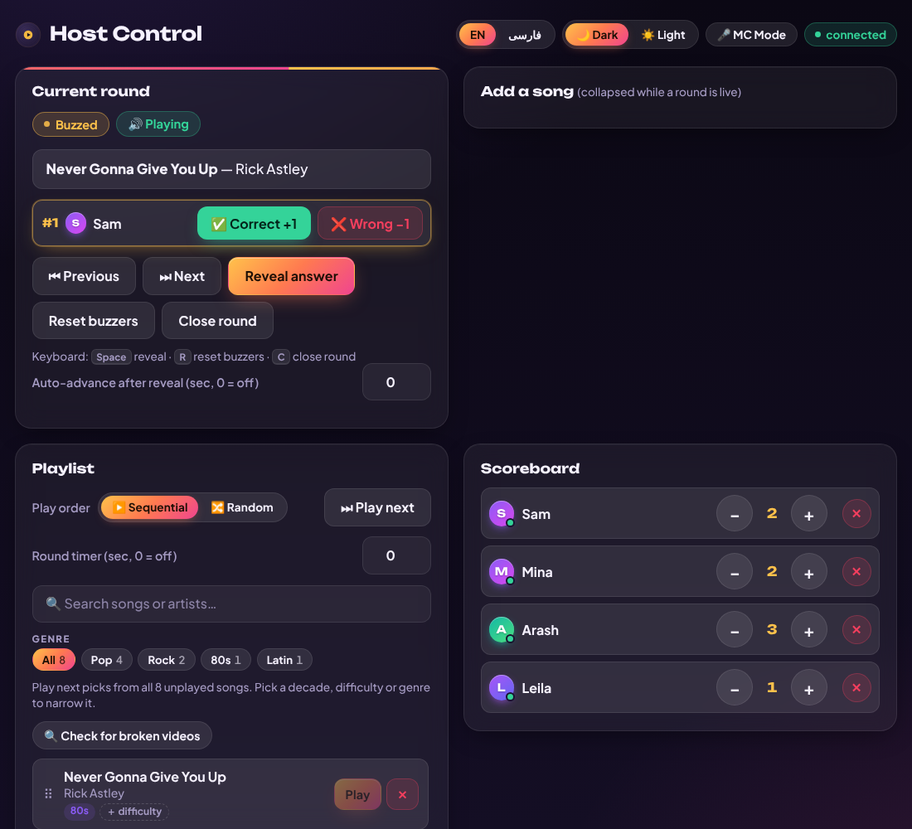

### 5. Correct answer, then the reveal
A right answer gets confetti and a chime. **Reveal answer** fades the record away to show the real video along with the title and artist.

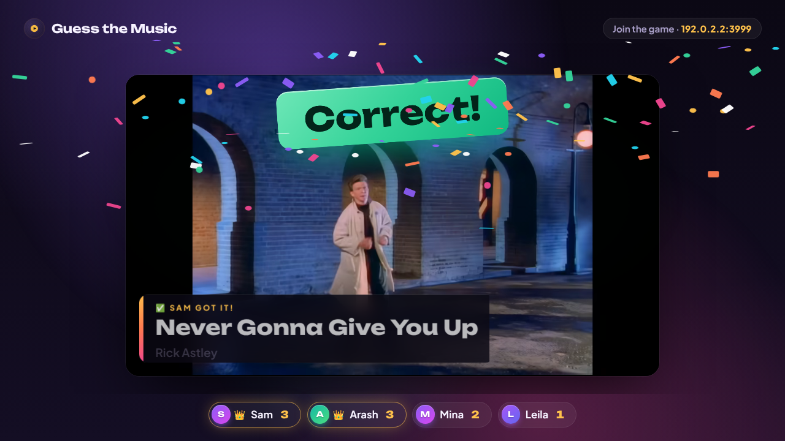
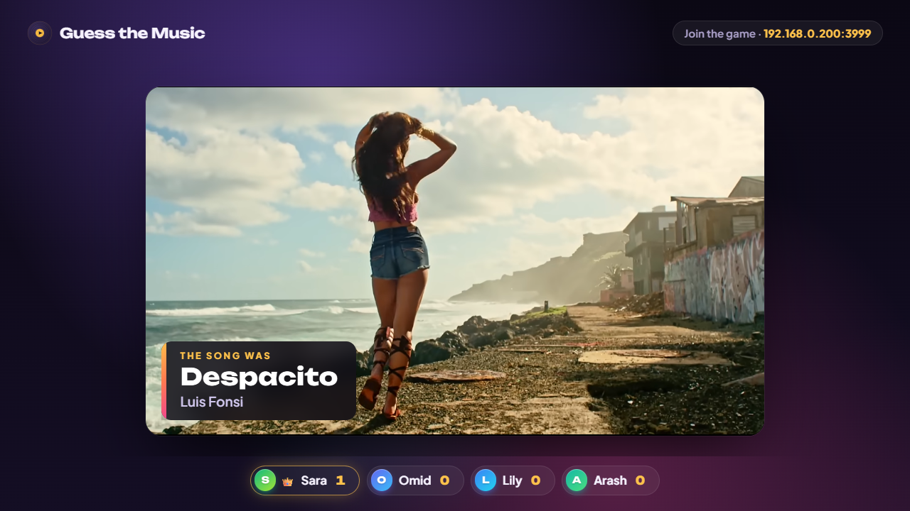

### 6. Final scores
When the host is done (or a score/round limit is hit), the TV builds a podium (third, then second, then the winner), with optional achievement badges and all-time records.

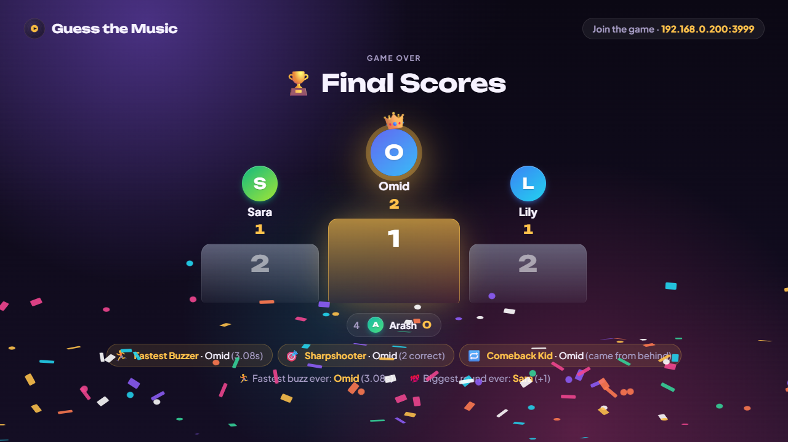

### More moments
A few of the optional game modes, all switched on from the host page:

**Category voting** — players vote on their phones and the TV bars fill up live.

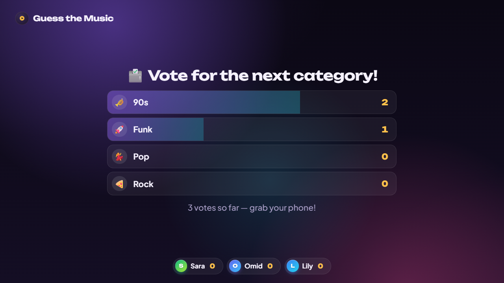

<p>
  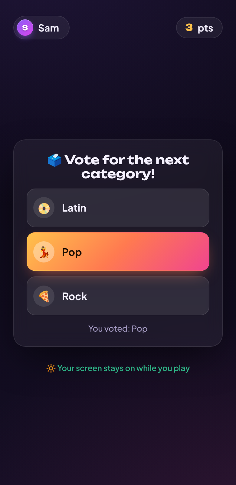
</p>

**Steal mechanic** — after a wrong answer, the next player to buzz and get it right steals a bonus point.

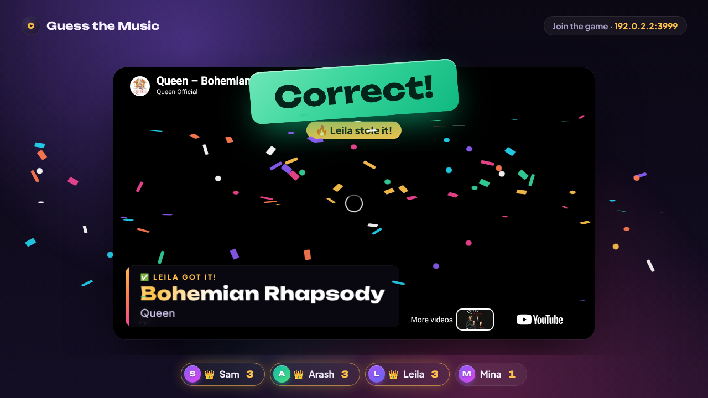

**Daily Double** — flag a song as wager-eligible and one player risks their own score on it.

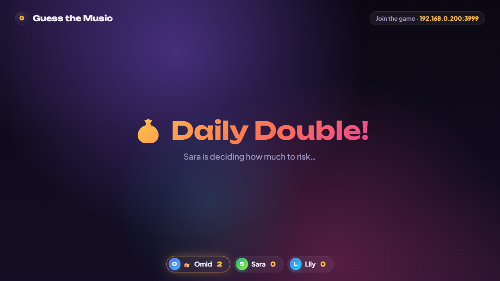

**Farsi and light theme** — the TV, phones and host can switch language and theme live from the host page, with full right-to-left layout.

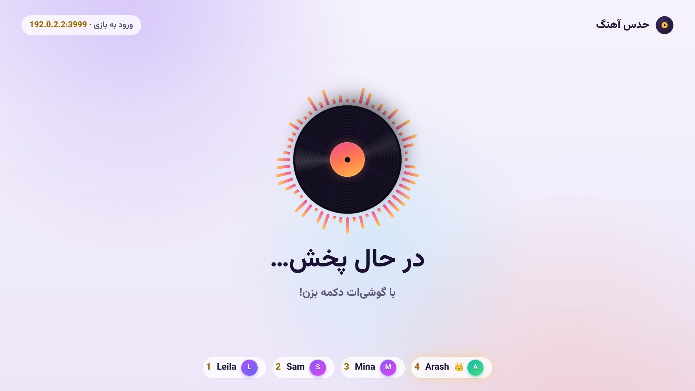

There's a lot more behind the **Game options** card on the host page — steal mechanic, speed bonus, per-song point values, team mode, blind mode, karaoke-style title hints, a mystery modifier round, category voting, wager rounds, snippet mode, pause, setlist presets, Farsi/English, and more.

> **Running on the always-on TV PC?** The server and kiosk screen already start themselves — see [Windows always-on setup](#windows-always-on-setup) below. You don't need `npm start`; just check `pm2 status`.

## 1. Install & start

```bash
npm install
npm start
```

You'll see something like:

```
TV (Android TV browser):  http://192.168.1.42:3000/tv.html
Host control (your phone/laptop): http://192.168.1.42:3000/host.html
Players join:              http://192.168.1.42:3000/player.html
```

Keep this terminal running for the whole game night — closing it stops the game (and clears scores; the playlist itself is saved to `playlist.json` and survives restarts).

**Everyone must be on the same WiFi network** (TV, host, and every player's phone).

## 2. Set it up

- **TV:** open the Android TV's browser and go to the `tv.html` link above. Tap the **"Tap once to enable sound"** button once so the browser is allowed to autoplay audio for the rest of the session.
- **You (the host):** open `host.html` on your own phone or laptop — this is your control panel, so keep the song titles secret from the TV screen. Hosting from your phone? Tip: open `host.html`, then use your browser's **"Add to Home Screen"** option — it installs as a proper app icon and opens full-screen next time, no browser address bar or re-typing the URL. Players can do the same with `player.html`.
- **Players:** scan the QR code shown on the TV (or open the `player.html` link) on their own phones, type a name, and they're in.

### Keeping phone screens awake

Player and host pages ask the phone to keep its screen on while the page is open — a small note under the buzzer says "Your screen stays on while you play". It starts on the first tap (joining counts) and comes back after switching apps. Because the game runs over plain `http` on your WiFi, the browser's modern Wake Lock feature isn't available, so it uses a hidden looping video instead (the bundled MIT-licensed [NoSleep.js](https://github.com/richtr/NoSleep.js)). If the phone refuses — most often **Low Power Mode on iPhone** or Battery Saver on Android — the note switches to a warning; the sure-fire fix is to set **Auto-Lock / Screen timeout to Never** in the phone's settings for the party. Pressing the side button or leaving the page still locks it, as always.

## 3. Add songs

On the host page, paste a YouTube link (or just the video ID) plus the title, and add it to the playlist. The title/artist are only ever shown to you — the TV and players never see them until you reveal.

### Only playable songs get in

When you add a song by hand, the app checks it with the YouTube API **before** adding it, and refuses videos that won't play on the TV: embedding disabled by the owner, age-restricted, blocked in your country, or missing/private. The message says which, and your form stays filled so you can paste a different upload (an "Artist - Topic" or lyric-video version often works). Playlist import applies the same checks. To catch country blocks, set `PLAYBACK_REGION` in `.env` to your 2-letter country code (e.g. `SE`) — see `.env.example`. With no `YOUTUBE_API_KEY` the song is still added, with a note that it couldn't be verified.

### Decade, genre and difficulty filters

Every song can carry a **genre** (the category tag), a **decade**, and a **difficulty** (easy / medium / hard). The playlist card has a filter row for each, with live counts, and they combine — e.g. *1980s + Easy + Rock* — on top of the search box. The filters also decide what **Play next**, **Random** and auto-advance pick from, so you can run a whole "90s hip-hop, medium" round without hunting through the list. Tap a song's difficulty badge to change it if you disagree with the rating.

Genres come from one fixed list (19 international ones plus Persian Pop, Persian Rock, Persian Hip-Hop, Persian Traditional, Persian Folk, Bandari, Persian Dance, Persian Jazz, Persian Electronic and Persian Alternative), so the filter row stays tidy. Turn on **Auto-tag new songs** in Game options and a newly added song gets its genre, year and difficulty filled in automatically (only the blanks — it never overrides what you typed).

A big playlist only renders the first 100 matching songs at a time (**Show more** loads the next page), so it stays fast with thousands of songs.

New songs added through the host page can carry a year (which sets the decade) and a difficulty; imported songs can be tagged the same way. The decade and difficulty values are best-effort estimates, so expect to nudge a few.

Tip: pick videos that don't show the song title on screen (plain "official audio" uploads work great), since the video only stays hidden behind a spinning-record animation *while the round is live* — once you hit **Reveal**, the real video appears.

## 4. Run a round

1. Hit **Play** next to a song in your playlist.
2. The TV shows a spinning record and starts playing the audio; players' buzzers light up.
3. First phone to tap **BUZZ** locks the buzzer — their name pops up on the TV.
4. Judge their answer out loud, then:
   - **✅ Correct:** hit **Correct** next to their name. The points are added, the TV shows a "Correct!" stamp, and the song is revealed automatically ("Ann got it!") — the round is over. (Turn off *Reveal the song on Correct* in Game options to reveal by hand.)
   - **❌ Wrong:** hit **Wrong**. The player loses 1 point (shown on the TV as "Cat −1"; scores can go below zero) and the TV and their phone show it. With the **Steal mechanic** option on, buzzing then reopens for everyone who hasn't had a turn (their buzzers say STEAL!, and a correct steal earns a bonus point). With it off, buzzing stays closed — reveal the answer, or hit **Reset buzzers** to let the others try. **Reset buzzers never costs points.** (Turn off *Wrong costs a point* in Game options for a penalty-free game; a Daily Double always loses the wager.)
5. Hit **Reveal answer** to show the real title/artist and video on the TV.
6. Hit **Close round** and pick the next song.

Hosting from a laptop/desktop with a keyboard: `Space` = reveal, `R` = reset buzzers, `C` = close round (shown on the host page itself; hidden on touch devices where it doesn't apply).

Scores update live on every screen. **Reset entire game** on the host page wipes scores and marks every song unplayed again for a rematch.

## Notes & limits

- This is plain local networking, not a hosted service — it only works while your laptop is running the server and everyone's on the same WiFi. It won't work over mobile data or across different networks.
- If a device can't reach the site, double check the IP address printed in the terminal is still current (it can change if you reconnect to WiFi) — restart the server if so.
- Player names/scores, the playlist, game options, saved setlist presets, and even the round currently in progress are all saved to disk as they change (`players.json`, `playlist.json`, `settings.json`, `presets.json`, `roundstate.json`) — a server restart mid-round (a crash, a `pm2 restart`, the kiosk PC rebooting) picks back up on the same song instead of dropping to idle. The one thing that doesn't survive a restart is an open category vote — it's quick enough to just start over.

## Windows always-on setup

This is how the game is deployed on the always-on PC that's HDMI'd into the TV. The server runs under [pm2](https://pm2.keymetrics.io/) so it survives reboots and restarts itself if it crashes, and the TV screen launches automatically in Chrome kiosk mode at logon.

**Already set up — nothing to install.** The commands below (`npm install -g pm2 ...`, `install-kiosk-startup.ps1`) were the one-time setup and don't need to be re-run. Day to day, all you need is:

| I want to... | Run this |
|---|---|
| Check the game is running | `pm2 status` |
| See the server's console output | `pm2 logs guess-the-music` |
| Restart the server (e.g. after a config change) | `pm2 restart guess-the-music` |
| Re-open the TV kiosk screen (e.g. you closed it) | `powershell -NoProfile -WindowStyle Hidden -ExecutionPolicy Bypass -File C:\Guess-the-Music\scripts\launch-kiosk.ps1` |
| Add songs / run the game | Open `host.html` on your phone — see [Set it up](#2-set-it-up) above |

`npm start` will fail with `EADDRINUSE` if you try it here — that's expected, it just means pm2 already has the server running on port 3000. You don't need it.

### Server: pm2

Install pm2 and the Windows startup helper globally, then start the app under it:

```powershell
npm install -g pm2 pm2-windows-startup
cd C:\Guess-the-Music
pm2 start server.js --name guess-the-music
pm2 save
pm2-startup install
```

- `pm2 save` snapshots the current process list so it comes back after a reboot.
- `pm2-startup install` registers a `HKCU\...\Run` entry that runs `pm2 resurrect` at logon — the PC needs to be set to auto-login for this to work fully unattended after a reboot.

**Check it's running:**

```powershell
pm2 status          # should show guess-the-music as "online"
pm2 logs guess-the-music   # tail the server's console output
```

### TV screen: Chrome kiosk mode

`scripts/launch-kiosk.ps1` waits for the server to answer on `http://localhost:3000/tv.html` (so it doesn't race the server on boot) and then opens it in Chrome with `--kiosk` and `--autoplay-policy=no-user-gesture-required` (so YouTube audio plays without a manual unlock tap), using a separate Chrome profile so it doesn't touch your normal browsing session.

To register it to launch automatically at logon (creates a shortcut in the Startup folder):

```powershell
cd C:\Guess-the-Music\scripts
powershell -ExecutionPolicy Bypass -File .\install-kiosk-startup.ps1
```

To launch it manually / test it without logging out:

```powershell
powershell -NoProfile -WindowStyle Hidden -ExecutionPolicy Bypass -File C:\Guess-the-Music\scripts\launch-kiosk.ps1
```

To exit kiosk mode, `Alt+F4` the Chrome window (or kill it from Task Manager).

### YouTube playlist import (optional)

The host page can bulk-import a whole YouTube playlist by link, using the official YouTube Data API v3. This needs your own free API key:

1. Go to the [Google Cloud Console](https://console.cloud.google.com/), create a project (or use an existing one).
2. Enable the **YouTube Data API v3** for that project.
3. Create an API key under **Credentials**.
4. Copy `.env.example` to `.env` in the project folder and paste the key in:
   ```
   YOUTUBE_API_KEY=your-key-here
   ```
5. `pm2 restart guess-the-music` so the server picks it up.

Everything else works fine without this — the host page just shows a clear error on the import button if it's not configured.

The same key also powers **"🔁 Find replacement"**, next to any song flagged as non-embeddable (the "Check for broken videos" scan, or the live "❌ Embedding disabled" error during a round). It searches YouTube for a different upload of the same song — often an "Artist - Topic" auto-upload or a lyric video allows embedding even when the official music video doesn't — and lets you swap it in with one click, keeping the song's title/artist/category/points as-is. Each lookup costs about 100 of your daily 10,000 API quota units, so it's a per-song action, not something to run on a whole playlist at once.

### Auto-categories (optional)

With the "Auto-categories" game option turned on, the host page asks Claude
(Anthropic's API) to suggest a category per song (manual add or playlist
import) — whichever of genre, mood, era, or origin/language best
distinguishes it (e.g. "Rock", "Happy", "80s", "Persian"), not just genre.
This needs its own API key, separate from YouTube:

1. Go to the [Anthropic Console](https://console.anthropic.com/), log in (or create a free account), and open **API Keys**.
2. Create a new key and copy it.
3. Add it to `.env`:
   ```
   ANTHROPIC_API_KEY=your-key-here
   ```
4. `pm2 restart guess-the-music` so the server picks it up.

Each suggestion is one small, cheap request (Claude Haiku, a few cents per
hundred songs at most) — a convenience the host can always override, never
a guarantee, and it never overwrites a category you typed yourself. Works
fine with nothing configured — the setting just won't find any suggestions.

### Playing from outside your WiFi

Everything above assumes the TV, host, and every player are on the same home
WiFi — that's still the default and needs nothing extra. To let a remote
friend join or to host from somewhere else, put the always-on PC's server
behind a [Cloudflare Tunnel](https://developers.cloudflare.com/cloudflare-one/connections/connect-networks/):
an outbound-only connection from this PC to Cloudflare's edge, so there's no
port-forwarding and no exposed IP on your router. The TV itself stays local
— it's physically HDMI'd into the room, so only `host.html`/`player.html`
need to be reachable remotely.

1. Needs a domain you own in a Cloudflare account (any domain registrar
   works — point its nameservers at Cloudflare, which is free).
2. Run the setup script, which installs `cloudflared` and walks you through
   the one-time account steps it can't do for you (your own Cloudflare
   login and domain choice):
   ```powershell
   cd C:\Guess-the-Music\scripts
   powershell -ExecutionPolicy Bypass -File .\install-cloudflare-tunnel.ps1
   ```
   It'll print the exact `cloudflared tunnel login` / `create` / `route dns`
   commands to run, then ask you to re-run the script with `-Hostname` once
   you have one — it registers `cloudflared` as a Windows service after
   that, the same role pm2 and the kiosk shortcut play for the rest of this
   app (auto-starts on reboot, no manual relaunching).
3. **Set a join PIN before sharing the link** — once the game is reachable
   from the whole internet rather than just your WiFi, anyone with the link
   could otherwise join as a player or take over hosting. Add to `.env`:
   ```
   JOIN_PIN=some-pin-only-you-and-your-friends-know
   ```
   then `pm2 restart guess-the-music`. This gates `host.html` and
   `player.html` registration, every host control event, and the server's `/api` routes — **the TV screen never asks for a PIN**,
   since it's a read-only kiosk display with no join/control surface worth
   gating, and the kiosk autostart script has no way to type one in anyway.
   Share the link as `https://your-hostname/player.html?pin=<the-pin>` (or
   `/host.html?pin=...`) so the PIN auto-fills instead of needing to be
   typed — the QR code on the TV already does exactly this for in-person
   joins, baking the PIN into the encoded URL for a zero-typing scan.
   Leave `JOIN_PIN` unset (the default) and nothing about joining changes
   at all — no PIN field appears anywhere.

   This is a lightweight deterrent, not hardened security: there's no rate
   limiting beyond a small deliberate delay on a wrong attempt, and the
   PIN travels in plain query-string params. It's sized for "keep random
   internet traffic out," not for protecting anything sensitive.

### Friendly hostname (mDNS)

The server also advertises itself as `guess-the-music.local` on the network, shown as a secondary hint under the QR code on the host page. It's a convenience only, not the primary path — the QR code and printed IP-based links stay the reliable way to join, since Android Chrome's support for `.local` addresses is inconsistent. The first time the server starts, Windows may prompt a one-time Firewall dialog for Node.js (multicast UDP) — allow it on **Private networks**.

### Log rotation

`pm2-logrotate` (the usual way to bound pm2's log file sizes) can't install on this machine — its installer breaks on the space in the Windows profile path (`C:\Users\Min Dator`), a known PM2-on-Windows issue. Instead, a small scheduled task handles it directly:

```powershell
cd C:\Guess-the-Music\scripts
powershell -ExecutionPolicy Bypass -File .\install-log-rotation.ps1
```

This registers a daily task (`GuessTheMusic-LogRotate`, runs at 4am) that rotates any pm2 log file over 10MB, keeping 3 old generations, and asks pm2 to reopen fresh log files. To run it manually / test it:

```powershell
powershell -NoProfile -ExecutionPolicy Bypass -File C:\Guess-the-Music\scripts\rotate-logs.ps1
```

### Updating the app later

```powershell
cd C:\Guess-the-Music
git pull
npm install
pm2 restart guess-the-music
```

### Finding the PC's LAN IP (for the QR code / player join links)

The server prints its own LAN IP on startup (`pm2 logs guess-the-music`), but if you need to check it directly:

```powershell
ipconfig
```

Look for the `IPv4 Address` under your active adapter (Wi-Fi or Ethernet). If it's changed since the server last started, restart the pm2 process (`pm2 restart guess-the-music`) so the printed URLs and QR code match.

> Consider setting a **DHCP reservation** for this PC in your router so its LAN IP never changes — otherwise the QR code can go stale after a router reboot or lease renewal.
